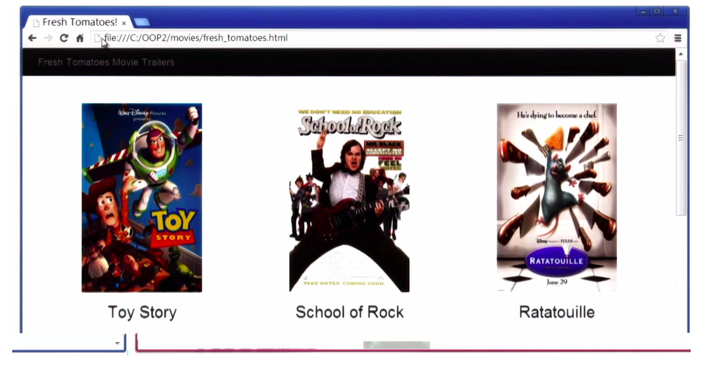

# Movie Trailer Website: Getting Started

## Change log

* April 9th 2015, added floating tooltip that shows movie's release date,add two new instances variables(release date and main cast)
* April 8th 2015, first working version, meets basic requirements

##How to use the project
1. Download all the files and make sure they are in the SAME folder
2. Assume you have python installed. If not, you can open the html file with your browser to see the end product.
3. Python is installed. Open python shell environment or command line terminal, go to the download folder.
4. Execute the following, make sure all three python files are in the same place(media.py, entertainment_center.py, fresh_tomatoes.py)

```bash
python entertainment_center.py
```

5. Browser will open and enjoy!

## Table of contents

* [Project Description] (#project-Description "Look down")
* [Project Display Example] (#project-display-example "Picture!")
* [Getting Started] (#getting-started "Look down")
* [Project Evaluation] (#project-evaluation "keep looking down")
* [To Submit] (#to-submit "This is the bottom")

## Project Description
In this project you will build a Movie Trailer Website where users can see your favorite movies and watch the trailers. You'll be writing server side code to store a list of movie titles, box art, poster images, and movie trailer URLs. The data will then be expressed on the web page and allow users to review the movies and watch the trailers. (Here's a hint: The data for the movies will be stored using Classes!)

NOTE: Because this project is a part of the Programming Foundations with Python course, if you have successfully completed the project before, please e-mail us at fullstack-project@udacity.com

You'll be learning how to write an application using object-oriented Python programming as well as how to serve HTML using a web server and how web servers receive requests, execute a block of code, and generate a response.

## Project Display Example


## Getting Started
For those who are new to the world of programming, having nothing (except your knowledge thus far) to start may feel a little overwhelming. Before we begin doing anything coding, there are several steps that you should take to make sure that you have everything downloaded in order to run your future web application.

1. The Programming Foundations with Python course will help you get started, specifically Lesson 3a. Be sure to review the course notes provided in the Downloadables section of Lesson 3a, this document will be very helpful understanding how the starter code fits in with your Python Movie class.

2. Make sure that you have Python downloaded on your computer. You may use Python 3, but keep in mind that we are going to be using Python 2. While this shouldn't be too problematic, Python 3 is not backwards compatible and you will be responsible to figure out any discrepancies.

3. Download the file fresh_tomatoes.py which contains the open_movies_page() function that will take in your list of movies and generate an HTML file including this content, producing a website to showcase your favorite movies.

4. Your task is to write a movie class in media.py. To do this, think about what the properties of a movie are that need to be encapsulated in a movie object such as movie titles, box art, poster images, and movie trailer URLs. Look at what open_movies_page() does with a list of movie objects for hints on how to design your movie class.

5. Next you’ll want to write a constructor for the movie class so that you can create instances of movie.

6. You can now create a list of these movie objects in entertainment_center.py by calling the constructor media.Movie() to instantiate movie objects. You’ve given movies their own custom data structure by defining the movie class and constructor, and now these objects can be stored in a list data structure. This list of movies is what the open_movies_page() function needs as input in order to build the HTML file, so you can display your website.

## Project Evaluation (Rubric)
The project will be evaluated on a Does Not Meet Specifications, Meets Specifications, and Exceeds Specifications scale. While every criteria will have a does not meet and meets category, not every criteria will have an exceeds option.
The rubric is broken into four major categories:

### Functionality
Does your project work the way it's supposed to? Are movies and their poster images being displayed on the web page? Is there a trailer link? Does it open from the Python file error free?
If you would like to exceed specifications, add more information about the movies, such as the actors, the release date, trivia, etc. or play around with the HTML and the CSS to redo the format and styling of the page.

### Code Quality
Is your code organized and professional? If you need an idea of how to format and style your code to look organized and professional, check out the Google Python Style Guide and the PEP-8 site.
Because Python is sensitive to white space and indents, make sure that you follow the formatting rules found here.

### Comments
Do you use comments to describe what is going on in your code? Would other developers be able to take a look at your code and easily be able to understand what your code is trying to do? A good starting point to see how to comment code would be to take a look at the comments section of the Google Python Style Guide.

### Documentation
When submitting your project, be sure to include a README file detailing how a user is to run your project (how to open the movie trailer website).
* Include information, such as, how do they get your code (download, etc.), are there any requirements? Are there any commands that need to be run in order to run your application?
* A good example to get you started (provided by a current student on the forum) is the README file for bootstrap: https://github.com/twbs/bootstrap#quick-start
* While this example is a bit extensive, it gives you an idea of what the purpose of a README file would be. README files are great because when there are programs that have a lot of interconnecting files or are new, README files provide instructions to other users on how to run your program.

## To Submit
Once you have finished your project, go to this link here. If you have a Github account (which we recommend), connect with Github to get started. If you do not have a Github account, follow the instructions here for Mac OS X 10.0 or later, here for Windows 7, 8, or 8.1, or here for anything else. These links will help you create a Github account to submit your project.
If you run into any trouble, send us an e-mail at fullstack-project@udacity.com, and we will be more than happy to help you.
