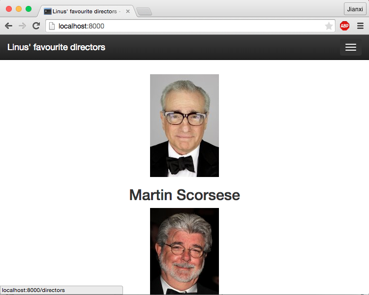
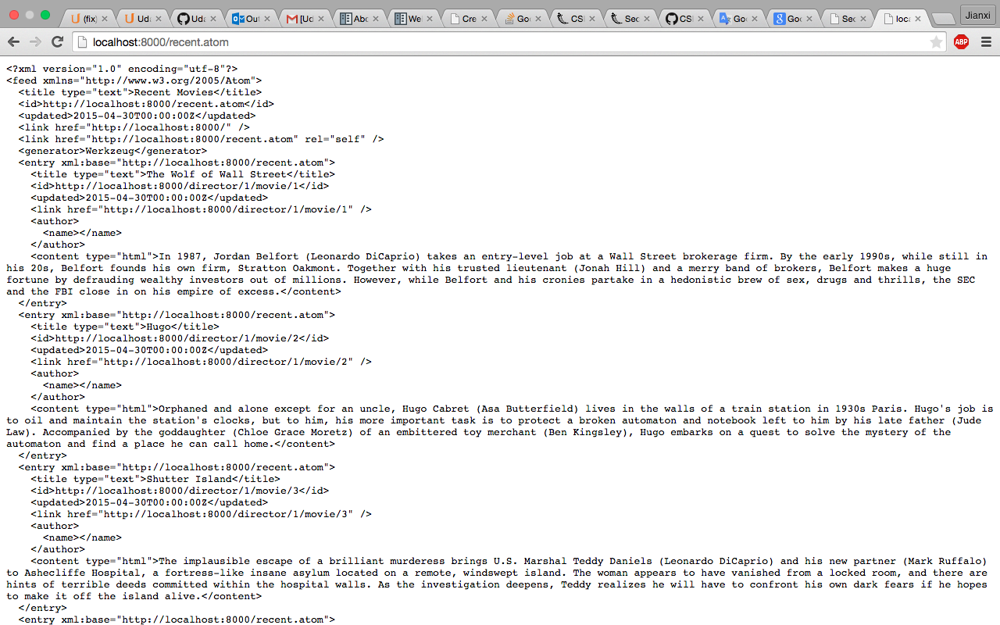
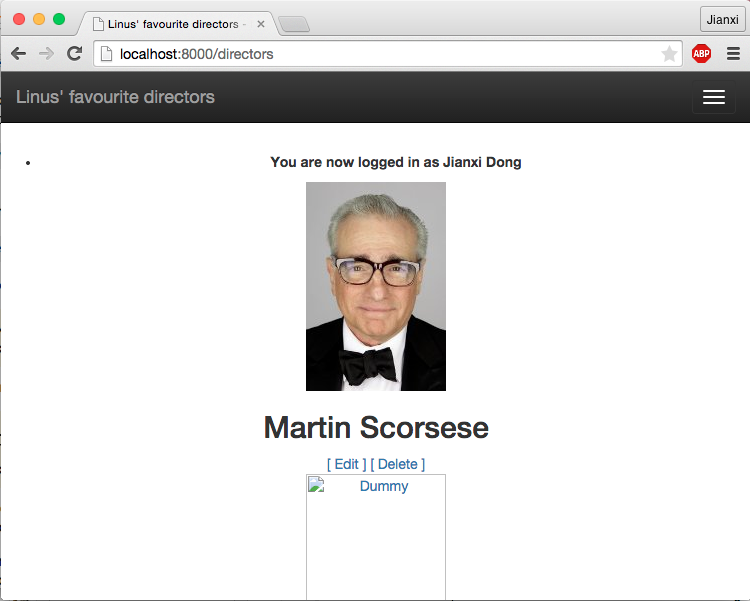
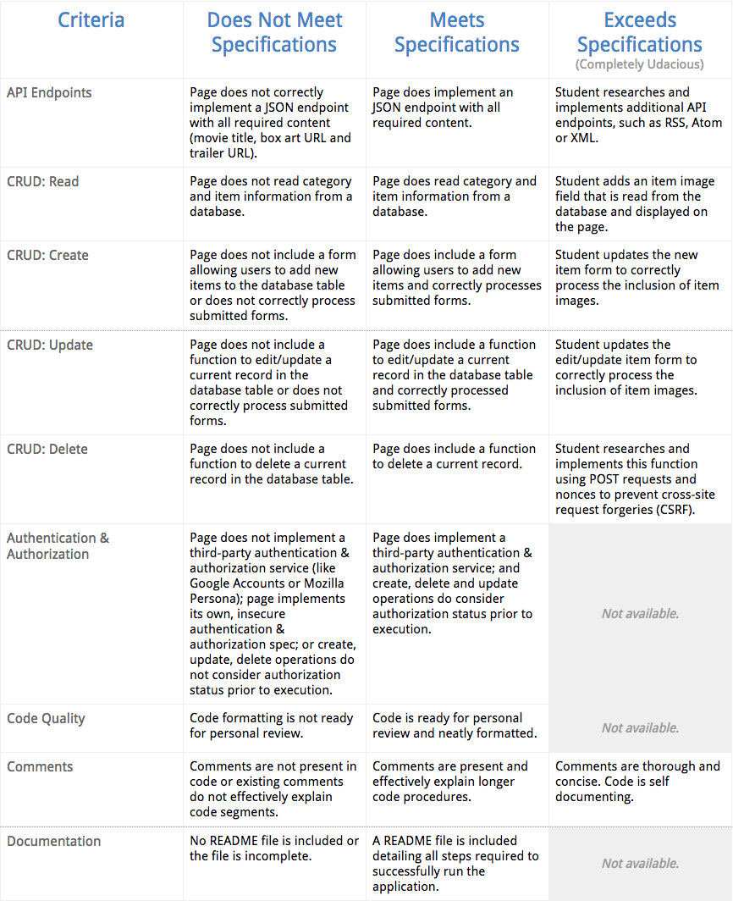

# Item Catalog: Linus Movie App

## Change log
* May 1st 2015, RFT and UPD project based on feedback. JSON error is gone, downgrade is not needed.
* April 30th 2015, ATOM API for extra credit, secure web application
* April 29th 2015, UPD styling on login/logout function.
* April 28th 2015, COMPLETE basic styling through all web pages.
* April 26th 2015, database settled. CURD methods implemented.
* April 24th 2015, mock up templates in places.
* April 21st 2015, initial commit. Readme file added.

## Project description
The project is a extended version of [project1 movie trailer app](https://github.com/linusdong/Udacity_Nanodegree_FullStackWeb/tree/master/P1), with database persistent and Bootstarp CSS style theme, G+ sign in based on OAuth2 and Flask framework integration.

Authenticated users should have the ability to post, edit, and delete their own directors and movies.

### Additional Functionality
In addition to the basic functions listed above, this project has many opportunities to go above and beyond what is required. Some ways to achieve exceeds specifications are to include the following requirements:

1. API Endpoints: Research and implement additional API endpoints, such as RSS, Atom, or XML. While we do require at the bare minimum a JSON endpoint, we encourage you to research and implement a different endpoint to see what else is out there.

2. CRUD: Read: Add an item image field that is read from the database and displayed on the page. This project is being built from scratch meaning that the information that you include and the layout of the page are entirely up to you. Add pictures for a more vibrant web application!

3. CRUD: Create: Update the new item form to correctly process the inclusion of item images. If you included additional information to include images, there should be a way to include those images when entering in new items into the database.

4. CRUD: Update: Update the edit/update item form to correctly process the inclusion of item images. Again, to stay consistent with the inclusion of images, items that already exist should have the option of changing the image as well.

5. CRUD: Delete: Research and implement this function using POST requests and nonces to prevent cross-site request forgeries (CSRF).

6. Comments: Comments are not just a way for you to keep track of what you’re writing in terms of code, but also a great way to help other developers who may be reading your code. While comment preferences may differ from team to team, the general idea is that good comments cover the main purpose of the code, mention inputs and outputs, etc. Check out the comments section of [PEP-8](https://www.python.org/dev/peps/pep-0008/#comments) and the [Google Python Style Guide](https://google-styleguide.googlecode.com/svn/trunk/pyguide.html?showone=Comments#Comments) to get a better idea of good comments.

## How to use the project
There are two ways to use the project. VM or on host machine.

###Use the project in VM
Install Vagrant VM if you have not done so already. Instructions on how to do so can be found [here](https://www.udacity.com/wiki/ud088/vagrant).

Inside Vagrant VM. Setup the project using git.
```bash
git clone https://github.com/linusdong/Udacity_Nanodegree_FullStackWeb.git
```

####Lazy yet more effective way. Clone the project inside the same folder with Vagrantfile on host machine.

###Use the project on host machine
Clone the project
```bash
git clone https://github.com/linusdong/Udacity_Nanodegree_FullStackWeb.git
```

Install essential packages.
```bash
sudo su
apt-get -qqy update
apt-get -qqy install postgresql python-psycopg2
apt-get -qqy install python-flask python-sqlalchemy
apt-get -qqy install python-pip
pip install oauth2client
pip install requests
pip install httplib2
```


###Run the app
Go to project folder, run the app using python, assume directors.db file is present. 
```bash
python application.py
```

If the db file is not there with application.py, setup database and populate dummy data.
```bash
python database-setup.py
python populatedatabase.py
```

Access and test your application by visiting http://localhost:8000 locally on your browser.

### API/JSON testing
[atom api testing](http://localhost:8000/recent.atom)
[get all the director](#)
[get all the movie from one director](#)
[get movie by id](#)

##Troubleshoot
###OAuth2Credentials object is not JSON serializable
ONLY do this step because you encounter the error. Downgrade python package to prevent errors. The ERROR is [OAuth2Credentials object is not JSON serializable](http://discussions.udacity.com/t/fix-oauth2credentials-object-is-not-json-serializable/15515)
```bash
sudo su
pip install werkzeug==0.8.3
pip install flask==0.9
pip install Flask-Login==0.1.3
```

## Project display example
### Guest index page

### Atom example

### Authenticated user


## Project grading guideline


